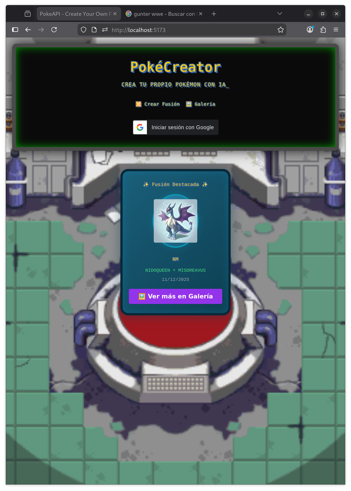

# 🎮 PokeAPI - Fusion Creator

Aplicación web para crear, guardar y compartir fusiones de Pokémon.


---

## 🚀 **Quick Start**

### 1️⃣ Primer setup (Primera vez)

```bash
git clone <repo>
cd PokeApi
cp .env.example .env      # Crear archivo .env
make init                 # Instalar todo (frontend + backend)
```

### 2️⃣ Iniciar desarrollo

```bash
make dev
```

**URLs:**
- Frontend: http://localhost:5173
- Backend: http://localhost:3000

### 🛑 Detener servicios

```bash
make down
```

---

## 📋 **Comandos Principales**

### � **Setup e Inicialización**

| Comando | Descripción |
|---------|-------------|
| `make init` | Instalar dependencias (primera vez) |
| `make dev` | Iniciar frontend + backend |
| `make up` | Iniciar contenedores (sin rebuild) |
| `make down` | Detener contenedores |

### 📊 **Monitoreo y Logs**

| Comando | Descripción |
|---------|-------------|
| `make logs` | Ver logs de todos los servicios (en vivo) |
| `make logs-frontend` | Logs solo del frontend |
| `make logs-backend` | Logs solo del backend |
| `make status` | Estado de contenedores, volúmenes y redes |
| `make health` | Verificar salud de servicios (HTTP checks) |
| `make ps` | Mostrar procesos activos |

### ⚡ **Gestión de Contenedores**

| Comando | Descripción |
|---------|-------------|
| `make stop` | Pausar contenedores (sin eliminar) |
| `make restart` | Reiniciar servicios (= down + up) |
| `make re` | Limpiar todo y reiniciar (= fclean + up) |
| `make build` | Reconstruir imágenes sin caché |

### 🚀 **Acceso Directo**

| Comando | Descripción |
|---------|-------------|
| `make shell-frontend` | Entrar al contenedor frontend |
| `make shell-backend` | Entrar al contenedor backend |

### 🗑️ **Limpieza**

| Comando | Descripción |
|---------|-------------|
| `make clean-app` | Limpiar node_modules (app y backend) |
| `make fclean` | Limpiar volúmenes y sistema |
| `make remove` | Limpiar y eliminar imágenes Docker |

### 📈 **Información**

| Comando | Descripción |
|---------|-------------|
| `make help` | Mostrar todos los comandos |
| `make info` | Alias de `make status` |
| `make test` | Alias de `make health` |
| `make resources` | Uso de recursos Docker |

---

## 🛠️ **Requisitos**

- Docker y docker-compose instalados
- Archivo `.env` configurado (copia de `.env.example`)
- Navegador web moderno
- Conexión a internet (PokeAPI + Pollinations.ai)

---

## ⚙️ **Variables de Entorno**

Copia `.env.example` a `.env` y configura:

```bash
# Frontend (.env)
VITE_BACKEND_URL=http://localhost:3000
VITE_POKEAPI_BASE=https://pokeapi.co/api/v2
VITE_POLLINATIONS_API=https://image.pollinations.ai/prompt
VITE_STORAGE_KEY_FUSIONS=pokemonFusions
VITE_GOOGLE_CLIENT_ID=your_client_id_here

# Backend (.env)
PORT=3000
NODE_ENV=development
JWT_SECRET=your_jwt_secret_here_change_this
JWT_EXPIRES_IN=7d
GOOGLE_CLIENT_ID=your_client_id_here
GOOGLE_CLIENT_SECRET=your_client_secret_here
```

---

## 📖 **Cómo Usar la App**

### 🎨 **Crear Fusión**
1. Ve a `/create`
2. Selecciona 2 Pokémon del dropdown
3. Click en ⚡ (generar fusión)
4. Espera la imagen (5-10 seg)
5. Nombra tu fusión
6. Click en 💾 Guardar

### 🖼️ **Galería**
1. Ve a `/gallery`
2. ⬇️ Descargar PNG
3. 📤 Compartir descripción
4. 🗑️ Eliminar

---

## 📁 **Estructura del Proyecto**

```
PokeApi/
├── app/                           # Frontend (React + Vite)
│   ├── src/
│   │   ├── components/
│   │   │   ├── FusionCard.tsx     # Componente reusable de tarjeta
│   │   │   ├── FusionPanel.tsx    # Contenedor para resultado
│   │   │   ├── Header.tsx         # Navegación
│   │   │   └── ProtectedRoute.tsx # Guard para rutas
│   │   ├── pages/
│   │   │   ├── Home.tsx           # Landing + OAuth2
│   │   │   ├── Create.tsx         # Crear fusiones
│   │   │   └── Gallery.tsx        # Galería de fusiones
│   │   ├── PokemonSelector.tsx    # Dropdown de Pokémon
│   │   ├── App.tsx                # Ruteo principal
│   │   └── index.css
│   ├── vite.config.ts
│   ├── tailwind.config.js
│   └── .env
│
├── backend/                       # Backend (Node.js + Express)
│   ├── src/
│   │   ├── index.js               # Servidor Express
│   │   └── auth.js                # OAuth2 + JWT
│   └── .env
│
├── docker-compose.yml             # Orquestación de contenedores
├── Makefile                       # Automatización
├── .env.example                   # Variables de ejemplo
└── README.md
```

---

## 🔧 **Stack Tecnológico**

- **Frontend**: React 19, TypeScript, Vite, TailwindCSS, React Router v7
- **Backend**: Node.js, Express, JWT, Passport (Google OAuth2)
- **APIs Externas**: PokeAPI, Pollinations.ai
- **Almacenamiento**: localStorage (fusiones)
- **Autenticación**: Google OAuth2 + JWT
- **Infraestructura**: Docker, docker-compose

---

## ✅ **Features**

- ✅ Fusión de Pokémon con IA
- ✅ Galería con persistencia (localStorage)
- ✅ Descargar PNG
- ✅ Compartir fusiones
- ✅ Diseño responsivo (mobile-first)
- ✅ SPA con React Router v7
- ✅ Docker + docker-compose
- ✅ OAuth2 Google (frontend)
- ✅ JWT Backend (preparado)

---

## 📊 **Roadmap**

| Feature | Estado |
|---------|--------|
| Fusión + Galería | ✅ Completo |
| OAuth2 Frontend | ✅ Listo |
| Backend API | ⏳ Completar CRUD |
| Base de Datos | ❌ Pendiente |
| Tests | ❌ Pendiente |

---

**Versión:** 1.0.0 | **Última actualización:** 11/12/2025

## 💾 **Almacenamiento**

Las fusiones se guardan en `localStorage` con estructura:
```json
{
  "id": "1734001234",
  "name": "Chartutu",
  "pokemon1": "charmander",
  "pokemon2": "bulbasaur",
  "image": "https://...",
  "createdAt": "2025-12-11T10:30:00.000Z"
}
```

---

## 📱 **Responsividad**

- **Mobile** (< 768px): 1 columna
- **Tablet** (768px - 1024px): 2 columnas
- **Desktop** (> 1024px): 3 columnas

---

## 🐛 **Troubleshooting**

**Las imágenes no se generan**
- Verifica conexión a internet
- Comprueba `VITE_POLLINATIONS_API` en .env
- Abre DevTools (F12) → Network

**Las fusiones no se guardan**
- Verifica localStorage en DevTools → Application
- Intenta en modo incógnito

**Pokémon selector vacío**
- Verifica `VITE_POKEAPI_BASE` en .env
- Si da error 429, PokeAPI está limitando (espera un poco)

**Docker no inicia**
```bash
docker-compose logs -f
# Verifica que puertos 5173 y 3000 estén libres
```

---

## ✅ **Features Implementados**

- ✅ Fusión de Pokémon con IA
- ✅ Galería con localStorage
- ✅ Descargar PNG
- ✅ Compartir fusiones
- ✅ Diseño responsivo
- ✅ SPA con React Router
- ✅ Docker

---

## 📊 **Estado**

| Feature | Estado |
|---------|--------|
| Fusión + Galería | ✅ Completo |
| OAuth2 Frontend | ✅ Listo |
| Backend API | ⏳ Preparado |
| Base de Datos | ❌ Pendiente |

---

**Versión:** 1.0.0 | **Última actualización:** 11/12/2025