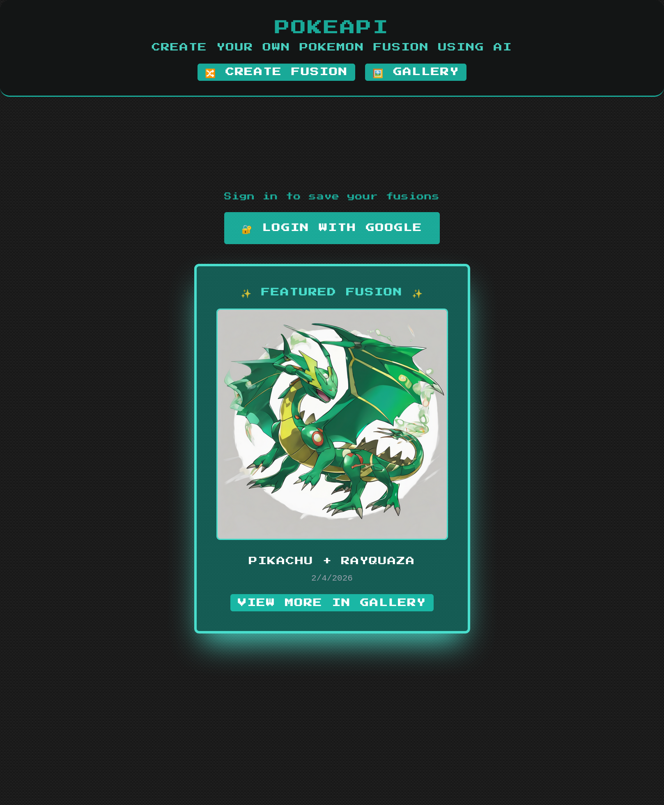

# 🔴 PokeAPI Full Stack - Generador de Fusiones Pokémon

> Una aplicación full-stack moderna que genera y exhibe fusiones de Pokémon impulsadas por IA utilizando tecnologías de vanguardia.

[](https://react.dev)
[](https://www.typescriptlang.org/)
[](https://expressjs.com/)
[](https://www.docker.com/)
[](LICENSE)

---

## 📸 Vista Previa del Proyecto

<div align="center">
  
</div>

---

## 🎯 Acerca del Proyecto

PokeAPI Full Stack es una aplicación web interactiva que combina el poder de la **generación de imágenes por IA** con **datos de Pokémon** para crear criaturas de fusión de Pokémon únicas. Los usuarios pueden seleccionar dos Pokémon cualesquiera de la PokeAPI oficial y generar una imagen de fusión personalizada utilizando Google Generative AI y Stability AI APIs.

### Características Principales

✨ **Generación de Fusiones Impulsadas por IA** - Utiliza Stable Diffusion para crear fusiones de Pokémon realistas

🔐 **Autenticación Google OAuth 2.0** - Sistema de inicio de sesión seguro con gestión de tokens JWT

📱 **Diseño Responsivo** - Construido con Tailwind CSS para una experiencia perfecta en todos los dispositivos

🎨 **Interfaz Interactiva** - Selección de Pokémon en tiempo real con vista previa en directo

💾 **Sistema de Galería** - Guarda y visualiza tus fusiones creadas (usuarios autenticados)

🐳 **Listo para Docker** - Containerización completa para un despliegue fácil

⚡ **Stack Moderno** - React 19, TypeScript, Vite, Express.js

---

## 🚀 Inicio Rápido

### Requisitos Previos

Antes de comenzar, asegúrate de tener:

- **Docker** y **Docker Compose** instalados
- **Node.js 18+** (si ejecutas sin Docker)
- **Claves API**:
  - Credenciales de Google OAuth 2.0
  - Clave API de Stability AI (para generación de imágenes)

### Instalación y Configuración

#### 1. Clonar el Repositorio

```bash
git clone https://github.com/jfercode/PokeApi.git
cd PokeApi
```

#### 2. Configurar Variables de Entorno

```bash
# Copia los archivos de ejemplo de entorno
cp .env.example app/.env
cp .env.example backend/.env
```

Edita ambos archivos `.env` y agrega tus credenciales:

**app/.env (Frontend)**
```env
VITE_BACKEND_URL=http://localhost:3000
VITE_GOOGLE_CLIENT_ID=tu_google_client_id_aqui
VITE_STORAGE_KEY_FUSIONS=pokeapi_fusions
```

**backend/.env (Backend)**
```env
PORT=3000
OAUTH_CLIENT_ID=tu_google_client_id_aqui
OAUTH_CLIENT_SECRET=tu_google_client_secret_aqui
JWT_SECRET=tu_jwt_secret_seguro_aqui
STABILITY_API_KEY=tu_stability_ai_key_aqui
```

#### 3. Iniciar la Aplicación

Usando el Makefile proporcionado (recomendado):

```bash
# Inicializar el proyecto (solo la primera vez)
make init

# Iniciar los servidores de desarrollo
make dev

# O iniciar en modo producción
make up
```

Tu aplicación estará disponible en:
- **Frontend**: http://localhost:5173
- **Backend API**: http://localhost:3000

### Configuración Manual (Sin Make)

```bash
# Iniciar contenedores Docker
docker compose up --build -d

# Los servicios instalarán automáticamente las dependencias
```
---

## 📋 Comandos Disponibles

### Desarrollo y Configuración

| Comando | Descripción |
|---------|-------------|
| `make init` | Inicializar proyecto con Vite + Tailwind (primera vez) |
| `make dev` | Iniciar servidores de desarrollo |
| `make check-env` | Verificar configuración del entorno |
| `make clean-app` | Limpiar archivos de configuración e reinstalar |

### Gestión de Docker

| Comando | Descripción |
|---------|-------------|
| `make up` | Iniciar todos los contenedores |
| `make down` | Detener todos los contenedores |
| `make re` | Reiniciar todo (limpiar + iniciar) |
| `make fclean` | Limpieza completa (volúmenes, huérfanos) |
| `make build` | Reconstruir imágenes sin caché |

### Monitoreo y Depuración

| Comando | Descripción |
|---------|-------------|
| `make logs` | Ver logs en tiempo real de todos los servicios |
| `make logs-frontend` | Solo logs del frontend |
| `make logs-backend` | Solo logs del backend |
| `make health` | Verificar estado de salud de los servicios |
| `make status` | Mostrar contenedores, volúmenes y redes |
| `make ps` | Listar contenedores en ejecución |
| `make resources` | Ver uso de recursos de Docker |

### Acceder a los Servicios

| Comando | Descripción |
|---------|-------------|
| `make shell-frontend` | Acceder al shell del contenedor frontend |
| `make shell-backend` | Acceder al shell del contenedor backend |


---

## 🛠️ Stack de Tecnologías

### Frontend

| Tecnología | Versión | Propósito |
|-----------|---------|---------|
| **React** | 19.2 | Framework de UI |
| **TypeScript** | 5.9 | JavaScript con tipos |
| **Vite** | 7.2 | Herramienta de compilación rápida |
| **Tailwind CSS** | 3.4 | Framework CSS de utilidades |
| **React Router** | 7.13 | Enrutamiento del lado del cliente |
| **@react-oauth/google** | 0.13 | Integración de Google OAuth |

### Backend

| Tecnología | Versión | Propósito |
|-----------|---------|---------|
| **Express.js** | 4.18 | Framework web |
| **Node.js** | 18+ | Runtime de JavaScript |
| **JWT** | 9.0 | Autenticación de tokens seguros |
| **Passport** | 0.7 | Middleware de autenticación |
| **Axios** | 1.13 | Cliente HTTP |
| **CORS** | 2.8 | Soporte entre orígenes |

### APIs y IA

| Servicio | Propósito |
|---------|---------|
| **Google Generative AI** | Generación avanzada de fusiones |
| **Stability AI (Stable Diffusion)** | Generación de imágenes de alta calidad |
| **PokeAPI** | Recuperación de datos de Pokémon |
| **Google OAuth 2.0** | Autenticación segura |

### Infraestructura

| Herramienta | Propósito |
|------|---------|
| **Docker** | Containerización |
| **Docker Compose** | Orquestación de múltiples contenedores |
| **Makefile** | Automatización de compilación |

---

## 🔧 Configuración

### Variables de Entorno

Crea archivos `.env` en ambos directorios `app/` y `backend/` con las variables requeridas.

#### Configuración de Google OAuth

1. Ve a [Google Cloud Console](https://console.cloud.google.com/)
2. Crea un nuevo proyecto
3. Habilita credenciales de OAuth 2.0
4. Agrega URIs de redirección autorizados:
   - `http://localhost:5173`
   - `http://localhost:3000/api/auth/callback`
5. Copia el Client ID y Client Secret

#### Configuración de Stability AI

1. Regístrate en [Stability AI](https://platform.stability.ai/)
2. Crea una clave API en la configuración de tu cuenta
3. Agrégala a `backend/.env`

---

## 🚢 Despliegue

### Preparando para Producción

1. **Actualiza variables de entorno** en ambos archivos `.env` con URLs de producción
2. **Establece un JWT_SECRET seguro** - Usa una cadena aleatoria fuerte
3. **Construye los recursos del frontend**:
   ```bash
   cd app && npm run build
   ```

### Despliegue con Docker en Producción

```bash
# Construir e iniciar contenedores en modo producción
make build
make up

# Verifica que los servicios estén ejecutándose
make health
```

## 📱 Características en Detalle

### 🏠 Página de Inicio
- Pantalla de bienvenida con autenticación
- Mostrar fusión aleatoria destacada de la galería
- Acceso rápido a las páginas Crear y Galería
- Información del perfil del usuario (cuando está autenticado)

### ✨ Página Crear
- Selección interactiva de Pokémon con búsqueda
- Vista previa en directo del Pokémon seleccionado
- Generación de fusión con un clic usando IA
- Descargar o guardar fusión en la galería (requiere login)

### 🎨 Página Galería
- Ver todas tus fusiones creadas
- Descargarlas
- Eliminarlas
- Compartirlas via url
- Requiere autenticación

### 🔐 Autenticación
- Inicio de sesión con Google OAuth 2.0
- Sesiones basadas en tokens JWT
- Funcionalidad segura de cierre de sesión
- Rutas protegidas para usuarios autenticados

---

## 🐛 Solución de Problemas

### Problemas Comunes

**¿Los contenedores no se inician?**
```bash
# Verifica las variables de entorno
make check-env

# Ver logs detallados
make logs
```

**¿Puerto ya en uso?**
```bash
# Detener todos los contenedores
make down

# Verifica que no haya procesos en los puertos 5173 y 3000
lsof -i :5173
lsof -i :3000
```

**¿Las variables de entorno no se cargan?**
- Asegúrate de que existan archivos `.env` en `app/` y `backend/`
- Verifica que no haya errores tipográficos en los nombres de variables
- Reinicia los contenedores: `make re`

**¿La generación de IA está fallando?**
- Verifica que las claves API sean válidas y estén activas
- Comprueba que tu cuenta de API tenga cuota disponible
- Revisa los logs del backend: `make logs-backend`

---

## 📊 Puntos Finales de la API

### Puntos Finales Públicos

| Método | Punto Final | Descripción |
|--------|----------|-------------|
| `GET` | `/health` | Verificación de salud |
| `GET` | `/` | Información de API |
| `GET` | `/api/auth/google` | Iniciar flujo de OAuth |
| `GET` | `/api/auth/callback` | Callback de OAuth |
| `POST` | `/api/auth/google-token` | Validar token de Google |
| `POST` | `/api/generate-fusion` | Generar imagen de fusión |

### Puntos Finales Protegidos (Requiere Autenticación)

| Método | Punto Final | Descripción |
|--------|----------|-------------|
| `GET` | `/api/user/profile` | Obtener perfil del usuario autenticado |
| `GET` | `/api/user/fusions` | Obtener fusiones guardadas del usuario |

---

## 🤝 Contribuir

¡Las contribuciones son bienvenidas! Siéntete libre de enviar un Pull Request.

1. Haz un fork del repositorio
2. Crea tu rama de características (`git checkout -b feature/CaracterísticaAsombrosa`)
3. Confirma tus cambios (`git commit -m 'Agregar CaracterísticaAsombrosa'`)
4. Sube a la rama (`git push origin feature/CaracterísticaAsombrosa`)
5. Abre un Pull Request

---
## Autor 🤝💡📬

<div align="center">
  <a href="https://github.com/jfercode">
    
    <br />
    <sub><b>Javier Fernández Correa</b></sub>
  </a>
</div>

---

## Licencia 📜✅🗝️

Este proyecto está bajo la licencia MIT.
